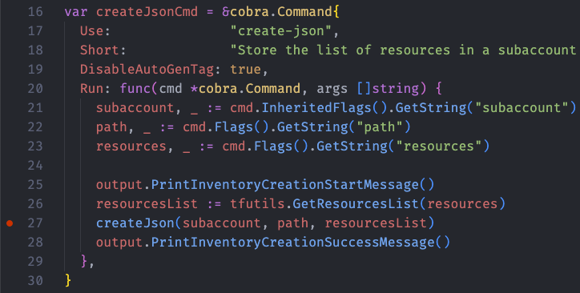
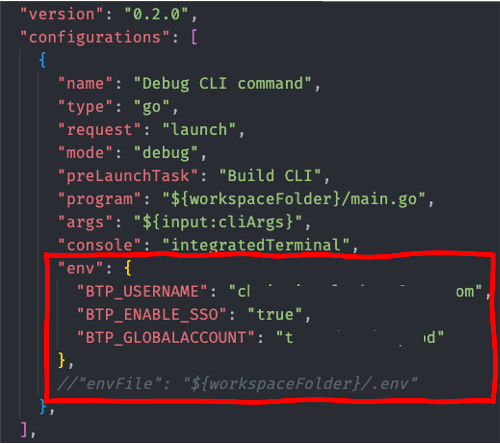
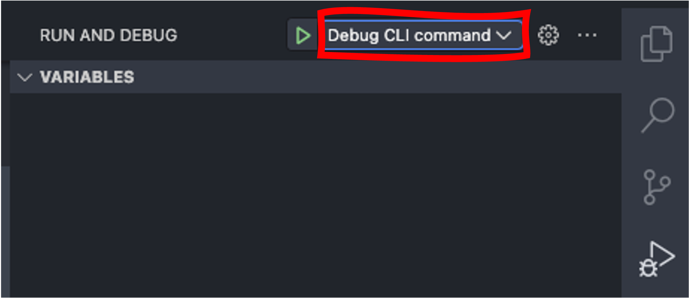
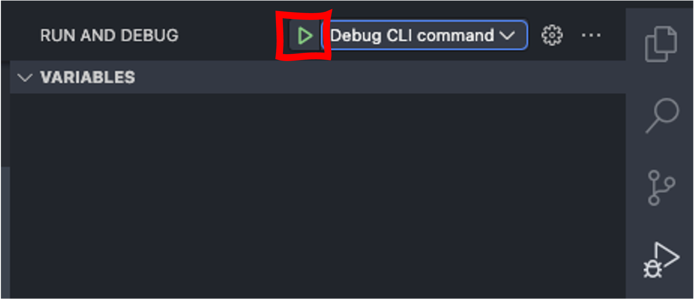
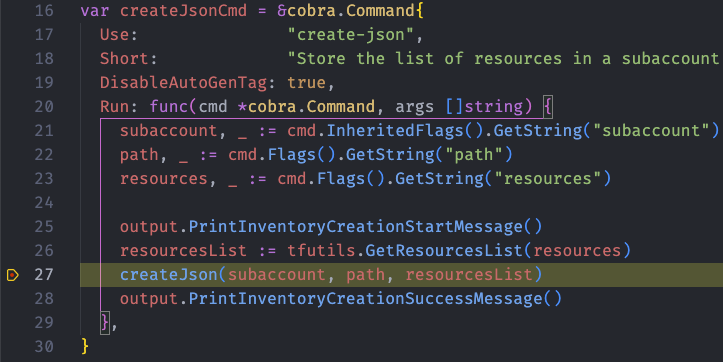

# Developer Guide

## Debugging Output

By default the CLI suppresses the verbose output of the different Terraform commands. However, they might be quite useful, when it comes to analyzing issues. For that you can add the `-d` (or `--debug `) flag to any command of the CLI, which will result in the full output of any `cmd.exec()` execution.

## Debug the CLI

We provide a configuration for debugging the btptf commands in VS Code. The configuration is available in the `.vscode` directory as `launch.json`

Here is an example on how to debug the command `btptf resource all`:

1. Set a breakpoint in the file `cmd/exportAll.go` in the run section of the command:

   

1. Adjust the `launch.json` configuration to consider your environment variable values. The default are single variables using SSO in the root of the repository:

   

   > [!WARNING]
   > The environment values will be displayed as clear text in the debug console. If you are using your password as environment paramater this will become visible when you start debugging. We therefore highly recommend to use the SSO option.

1. Open the debug perspective in the VS Code side bar:

   

1. Select the configuration `Debug CLI command`:

   

1. Run the selection by pressing the green triangle:

   

1. VS Code will prompt you for the command via the command palette. It defaults to `resource all -s`. Enter the command and the parameters you want to use for the command execution. In our case we add a subaccount ID and confirm by pressing `Enter`:

   

1. The debugger will start and hit the breakpoint:

   

Happy debugging!

## Generate markdown documentation

When updating command descriptions you must generate the markdown documentation via the make file:

```bash
make docs
```
