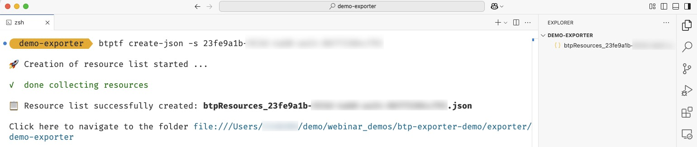
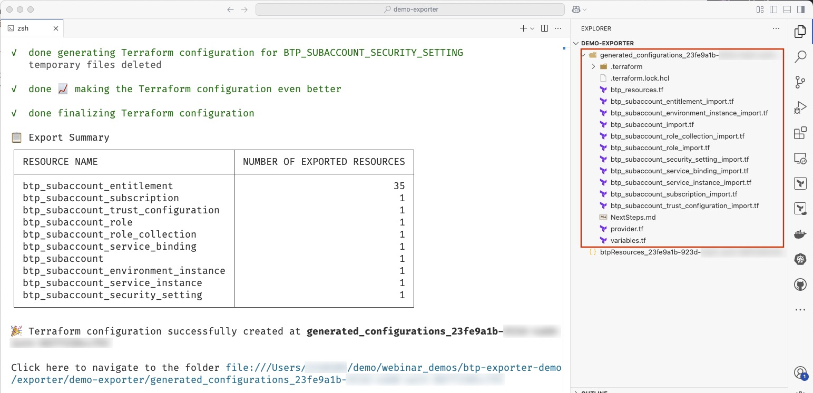
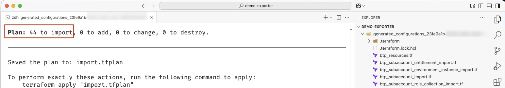
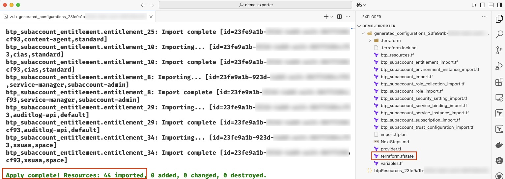

[](https://api.reuse.software/info/github.com/SAP/terraform-exporter-btp)
[](https://goreportcard.com/report/github.com/SAP/terraform-exporter-btp)
[](https://github.com/SAP/terraform-exporter-btp/actions/workflows/codeql.yml)
[](https://www.bestpractices.dev/projects/9673)


# Terraform Exporter for SAP BTP

> [!CAUTION]
> The Terraform Exporter for SAP BTP is still under development. It is not intended for productive useage in its current state.

## Overview
The *Terraform Exporter for SAP BTP* (btptf CLI) is a handy tool that makes it easier to bring your existing SAP Business Technology Platform (BTP) resources into Terraform. With it, you can take things like subaccounts and directories in BTP and turn them into Terraform state and configuration files. It's especially useful for teams who are moving to Terraform but still need to manage older infrastructure or SAP BTP accounts that are already set up.

Here's how it works:

- **Resource Identification**: Terraform Exporter for SAP BTP identifies the SAP BTP resources and maps them to corresponding Terraform resources using the BTP CLI Server APIs.
- **Import Process**: The tool utilizes Terraform's import function to integrate each resource into Terraform's state.
- **Configuration Generation**: After import, it generates the Terraform code (in HashiCorp Configuration Language - HCL) for each resource, enabling further customizations as needed.

You can install btptf CLI across various operating systems as described below.

## Installation

You have two options to install the btptf CLI:

1. Download the pre-built binary.
2. Local build

The following sections describe the details for the two options.


### Pre-Built Binary

The easiest way to get the binary is to download from the [releases section](https://github.com/SAP/terraform-exporter-btp/releases) of this repository. Select the version that you want to use and download the binary that fits your operating system from the `assets` of the release. We recommend using the latest version.


### Local Build

If you want to build the binary from scratch, follow these steps:

1. Open this repository inside VS Code Editor

2. We have setup a devcontainer, so reopen the repository in the devcontainer.

3. Open a terminal in VS Code and install the binary by running

   ```bash
    make install
    ```
   This will implicitly trigger a build of the source. If you want to build *without* install, execute `make build`.

4. The system will store the binary as `btptf` (`btptf.exe` in case of Windows) in the default binary path of your Go installation `$GOPATH/bin`.


**You find the value of the GOPATH via `go env GOPATH`**

#### Troubleshooting

##### Binary Not Executable (MacOS or Linux)

In case you get an error that the binary is not executable, navigate to the location of the binary and execute the following command:

```bash
chmod +x btptf
```

## Security Considerations

When using Terraform Exporter for SAP BTP, following security best practices is key to ensuring that your SAP BTP resources and Terraform configurations are managed safely. Here are some recommended security practices:

1. **Access Control and Least Privilege**: Ensure that the user running the Terraform exporter has only the necessary permissions, following the principle of least privilege. This helps minimize the risk of accidental or malicious modifications to resources​.
​
2. **Secure Storage for State Files**: Enable encryption for additional security for Terraform stat files. This is to protect sensitive data in Terraform’s state files, such as resource IDs and secrets. Store these state files in secure, remote back-ends configured with access policies.

3. **Network Security and Encryption**: When using remote state storage, ensure that data is encrypted both in transit and at rest.

4. **Terraform Code and Secrets Management**: Avoid hard coding secrets directly in Terraform configurations. Instead, use a secure vault services to manage secrets and inject them into configurations at runtime. This reduces the risk of exposing sensitive information in code repositories​

5. **Review and Update Terraform Configurations Regularly**: Ensure that exported configurations align with current security and compliance requirements. Regularly review and update configurations, removing any deprecated or unused resources that could expose vulnerabilities.


Following these guidelines can greatly reduce the security risks associated with managing SAP BTP resources using Terraform and Terraform Exporter for SAP BTP.

## Concepts
The Terraform Exporter for SAP BTP (btptf CLI) provides a convenience functionality to import existing subaccounts on SAP BTP into Terraform configurations. The configurations delivered by the btptf CLI are:
•	Provider configuration (excluding credentials)
•	[Import](https://developer.hashicorp.com/terraform/language/import) blocks for the resources
•	Resource configuration retrieved from the platform
The btptf CLI offers two options for the import:
1.	As a one-step process via creating the import configuration by naming the resource types.

2.	As a two-step process via creating a local JSON file with the resources to be imported. This file can be adjusted and then used as a configuration for the import.

To achieve these goals the btptf CLI encapsulates three major functionalities,
1.	Fetching and parsing the markdown documentation for the resource from the provider repository (publicly available) to collect the information on the resource keys needed for the import.

2.	Creating the files with the import block based on the information from the documentation and reading the data from the platform leveraging the corresponding Terraform [data sources](https://registry.terraform.io/providers/SAP/btp/latest/docs).

3.	Executing the Terraform commands via Terraform CLI to generate the resource configuration and store the results in the file system.

The following points should be mentioned:
1. The authentication to be able to read the data from the platform leverages the options provided by the [Terraform Provider for SAP BTP](https://registry.terraform.io/providers/SAP/btp/latestdocumentation). The values must be provided via environment variables.
No value is stored in the CLI or in any of the generated configuration files. The resources the user has access are the ones that are reflected in the role collections assigned to the authenticated user.

2. No state file is created by the btptf CLI. The reason is that we want to enable best practices and allow the user to add a remote state storage configuration (always customer specific) to the configuration before triggering the state import.


## Prerequisite

After executing the setup of the btptf CLI, you must set some required environment variables needed for authentication.

1. Set the environment variable `BTP_GLOBALACCOUNT` which specifies the *subdomain* of your SAP BTP global account.

2. Depending on the authentication flow, set the following environment variables:

   - Basic Authentication: set the environment variable `BTP_USERNAME` and `BTP_PASSWORD`
   - X509 Authentication: set the environment variables `BTP_TLS_CLIENT_CERTIFICATE`, `BTP_TLS_CLIENT_KEY`, `BTP_TLS_IDP_URL`

3. In addition you can set the following optional parameters as environment variables, depending on your requirements:

   - Specify a custom IdP for the authentication via `BTP_IDP`
   - Specify a URL of the BTP CLI server (SAP internal only) via `BTP_CLI_SERVER_URL`
   - Specify the login using SSO via `BTP_ENABLE_SSO` (true/false)

The parameters correspond to the Terraform provider configuration options that you find in the [BTP Terraform Provider documentation](https://registry.terraform.io/providers/SAP/btp/latest/docs)

How to set the parameters depends on your setup and is OS-specific:

- On Windows (example):

   ```powershell
   $env:BTP_USERNAME=<MY SAP BTP USERNAME>
   ```

- On MacOS and Linux (example):

   ```bash
   export BTP_USERNAME=<MY SAP BTP USERNAME>
   ```

- In a devcontainer:
   - Create a file `devcontainer.env` in the `.devcontainer` directory
   - Add the environment variables in the file. Here is an example:

      ```txt
      BTP_USERNAME='<MY SAP BTP USERNAME>'
      BTP_PASSWORD='<MY SAP BTP PASSWORD>'
      BTP_GLOBALACCOUNT='<MY SAP BTP GLOBAL ACCOUNT SUBDOMAIN>'
      ```
  - Start the devcontainer option `Terraform exporter for SAP BTP - Development (with env file)`. The environment variables defined in the `devcontainer.env` file will be automatically injected.

- Alternative via `.env` file (available on MacOS and Linux only):
   - Create a file `.env` in the root of the project
   - Add the environment variables in the file. Here is an example:

      ```txt
      BTP_USERNAME='<MY SAP BTP USERNAME>'
      BTP_PASSWORD='<MY SAP BTP PASSWORD>'
      BTP_GLOBALACCOUNT='<MY SAP BTP GLOBAL ACCOUNT SUBDOMAIN>'
      ```

    - Execute the following command in a terminal:

       ```bash
       export $(xargs <.env)
       ```


**There is no predefined functionality in PowerShell to achieve the same. A custom script is needed.**

## Exporting SAP BTP Resources

The btptf CLI offers several commands for the export of Terraform configurations of SAP BTP. Currently the CLI supports exporting of SAP BTP resources like Subaccounts and directories. The CLI supports two ways to export BTP resources
- Exporting resources via JSON
- Exporting resources

### Exporting Resources via JSON
This is a two-step process where the JSON can be created manually or via `btptf create-json` command

1. Create a JSON file with a list of BTP resources that can be imported

```bash
btptf create-json - s <subaccount id>
```
Review and adapt the JSON file and remove resources which need not be imported.

2. Export resources from SAP BTP via a JSON file

```bash
btptf export-by-json -p <path to json file>
```

### Exporting Resources

Export resources from SAP BTP

```bash
btptf export -s <subaccount id>
```

You find a comprehensive overview of the commands and the options in the [documentation](./docs/btptf.md).

## Examples
The below example explains how to use the Terraform Exporter for SAP BTP to export the Terraform configuration for an existing SAP BTP Subaccount and use it to generate the Terraform state. Post this the BTP Subaccount can be managed by Terraform.

1. Launch SAP BTP Cockpit and navigate to an existing subaccount or create a new subaccount.

2. In the Subaccount, navigate to the 'Overview' tab and find the 'Subaccount ID'

3. Generate the json file which contains the list of resources to be exported. This json file can be generated by running the btptf CLI command
   ```bash
   btptf create-json - s 9d3471e7-a6b3-48e2-ae4b-b9426bb24cd1
   ```
   The resources list file with the name btpResources_<subaccount id>.json e.g `btpResources_9d3471e7-a6b3-48e2-ae4b-b9426bb24cd1.json` gets generated.
   

4. Edit the json file and remove the resources which need not be exported and managed by Terraform.

5. Run the btptf CLI command to export Terraform configuration using the json file. `btptf export-by-json -p btpResources_<subaccount id>.json -s <subaccount id>`
   ```bash
   btptf export-by-json -p btpResources_9d3471e7-a6b3-48e2-ae4b-b9426bb24cd1.json -s 9d3471e7-a6b3-48e2-ae4b-b9426bb24cd1
   ```
6. The Terraform configurations will be generated under the folder `generated_configurations_9d3471e7-a6b3-48e2-ae4b-b9426bb24cd1`. The output of the command will show an export summary which contains the information about which 'Resource Names' and their respective count.


7. Review the markdown file NextSteps.md under the folder `generated_configurations_9d3471e7-a6b3-48e2-ae4b-b9426bb24cd1` and adapt the Terraform configuration files as mentioned in the NextSteps.md

8. In the terminal, navigate to the folder `generated_configurations_9d3471e7-a6b3-48e2-ae4b-b9426bb24cd1` and run the Terraform plan command.
This will show a plan of how many resources will be imported, added, changed and destroyed.


9. Run the command Terraform apply. This will import the Terraform state and store it in the terraform.state file in under the folder `generated_configurations_9d3471e7-a6b3-48e2-ae4b-b9426bb24cd1`.


10. Now, to modify your BTP resources in this subaccount you can change to Terraform configuration files and run a Terraform apply.

## Developer Guide

If you want to contribute to the code of the Terraform Exporter for SAP BTP, please check our [Contribution Guidelines](CONTRIBUTING.md). The technical setup and how to get started are described in the [Developer Guide](./guidelines/DEVELOPER-GUIDE.md)

## Support, Feedback, Contributing

This project is open to feature requests/suggestions, bug reports, and so on, via [GitHub issues](https://github.com/SAP/terraform-exporter-for-sap-btp/issues). Contribution and feedback are encouraged and always welcome. For more information about how to contribute, the project structure, as well as additional contribution information, see our [Contribution Guidelines](CONTRIBUTING.md).

## Security / Disclosure
If you find any bug that may be a security problem, please follow our instructions at [in our security policy](https://github.com/SAP/terraform-exporter-for-sap-btp/security/policy) on how to report it. Please do not create GitHub issues for security-related doubts or problems.

## Code of Conduct

We as members, contributors, and leaders pledge to make participation in our community a harassment-free experience for everyone. By participating in this project, you agree to abide by its [Code of Conduct](https://github.com/SAP/.github/blob/main/CODE_OF_CONDUCT.md) at all times.

## Licensing

Copyright 2024 SAP SE or an SAP affiliate company and terraform-exporter-for-sap-btp contributors. Please see our [LICENSE](LICENSE) for copyright and license information. Detailed information including third-party components and their licensing/copyright information is available [via the REUSE tool](https://api.reuse.software/info/github.com/SAP/terraform-exporter-btp).
