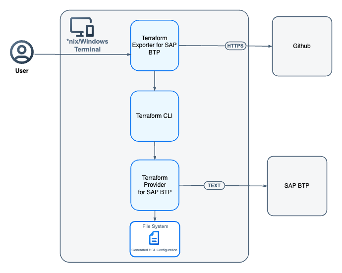

# Concepts
The Terraform Exporter for SAP BTP (btptf CLI) provides a convenience functionality to import existing subaccounts on SAP BTP into Terraform/OpenTofu configurations. The configurations delivered by the btptf CLI are:

  -	Provider configuration (excluding credentials)
  -	[Import](https://developer.hashicorp.com/terraform/language/import) blocks for the resources
  -	Resource configuration retrieved from the platform

The btptf CLI offers two options for the import:

1.	As a one-step process via creating the import configuration by naming the resource types.

2.	As a two-step process via creating a local JSON file with the resources to be imported. This file can be adjusted and then used as a configuration for the import.

## Basic Flow

   

1.	Fetching and parsing the markdown documentation for the resource from the provider repository (publicly available) to collect the information on the resource keys needed for the import.

2.	Creating the files with the import block based on the information from the documentation and reading the data from the platform leveraging the corresponding Terraform [data sources](https://registry.terraform.io/providers/SAP/btp/latest/docs).

3.	Executing the Terraform/OpenTofu commands via Terraform/OpenTofu CLI to generate the resource configuration and store the results in the file system.

The following points should be mentioned:

1. The authentication to be able to read the data from the platform leverages the options provided by the [Terraform Provider for SAP BTP](https://registry.terraform.io/providers/SAP/btp/latestdocumentation). The values must be provided via environment variables.
No value is stored in the CLI or in any of the generated configuration files. The resources the user has access are the ones that are reflected in the role collections assigned to the authenticated user.

2. No state file is created by the btptf CLI. The reason is that we want to enable best practices and allow the user to add a remote state storage configuration (always customer specific) to the configuration before triggering the state import.
