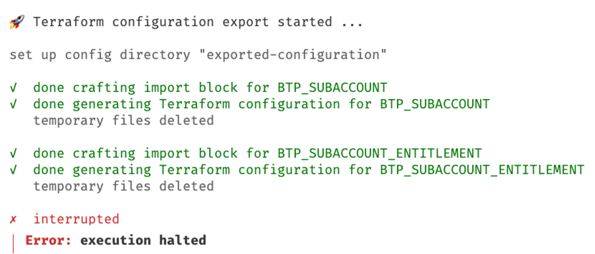
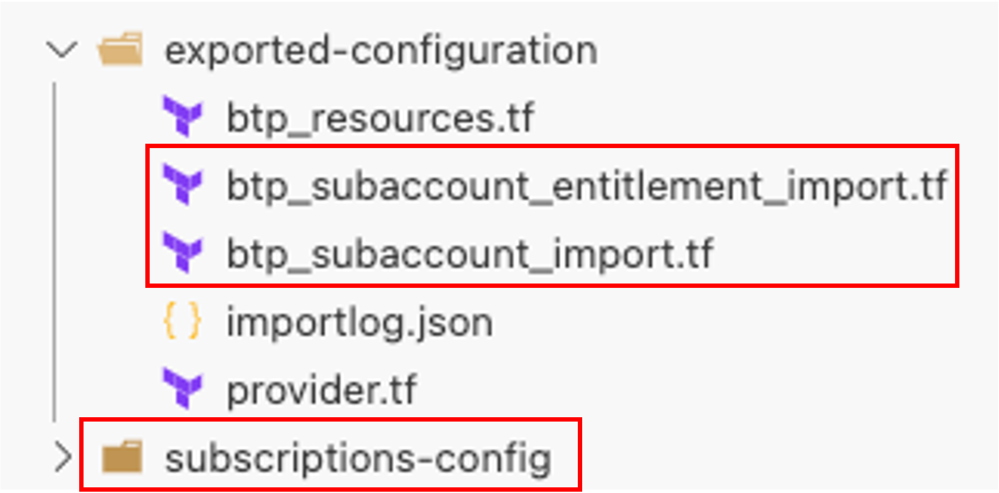
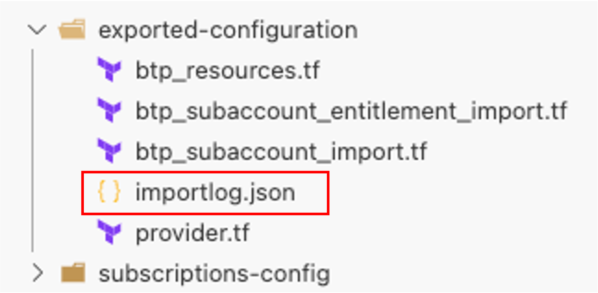
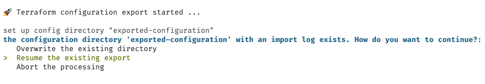
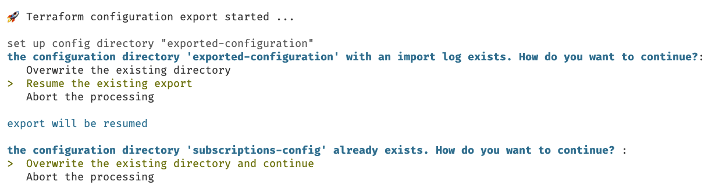
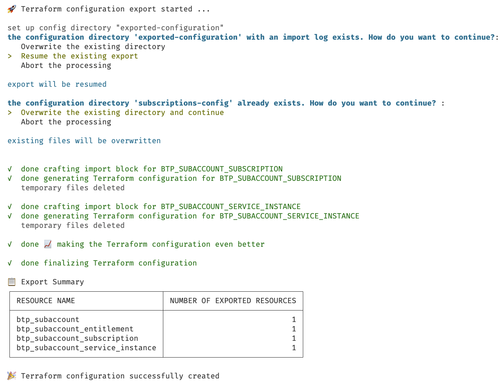
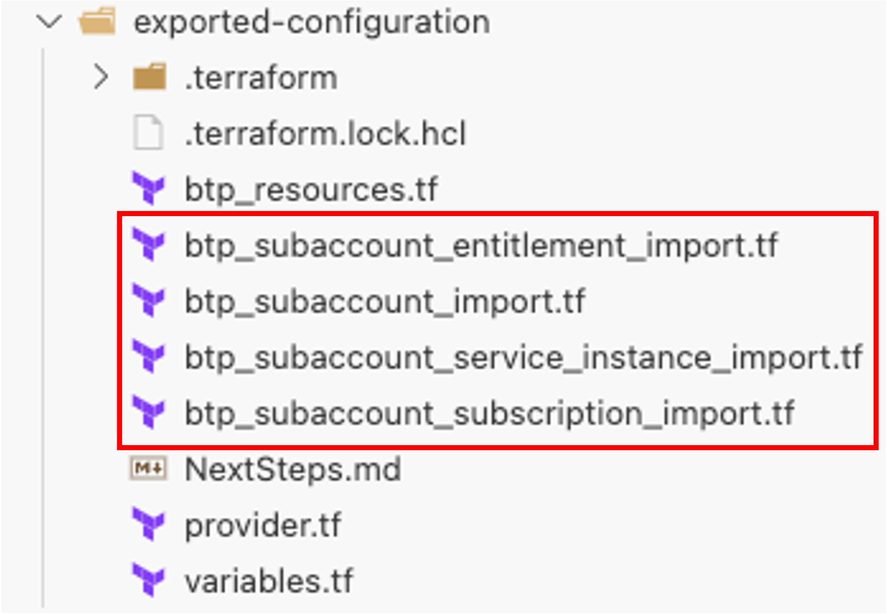

# How to Resume a Failed Export

If the export of existing infrastructure via the Terraform Exporter for SAP BTP runs into errors for various reasons. For example, there could be temporal network issues or platform issues.

If the export fails, you can resume it from the last safepoint by running the **same command again**, without deleting any temporary files.  

## Example of How the Resumption of a Failed Export Works

Let's assume you're exporting a subaccount based on a JSON configuration called `btpResources.json`. The resources to export are:

- a subaccount
- an entitlement
- a subscription
- a service instance

In addition, you want to store the generated code into the directory `exported configuration`. Consequently, you execute the command:

```bash
btptf export-by-json -s 12345678-abcd-efgh-ae24-86ff3384cf93 -p btpResources.json -c exported-configuration
```

The export process starts, but then runs into an error:




The created files show that the export was interrupted, as the configuration is not complete:



In addition, a temporary directory `subscriptions-config` is stored.

!!! info
    Directories that follow the naming convention `<resource>-config` are part of the export process as a temporary directory containing the resource specific information. They get removed when the resource was executed successfully or in case of an error that is handled by the Terraform Exporter for SAP BTP. However, in error situations you might see these directories. It is safe to delete them.

You also recognize a file called `importlog.json` in the `exported-configuration` directory:



The Terraform Exporter for SAP BTP uses this file to track the successfully exported resources.

!!! info
    This file will be removed if the export was successful.

To resume the processing, you don't need to make any changes to the files, but execute the original command:

```bash
btptf export-by-json -s 12345678-abcd-efgh-ae24-86ff3384cf93 -p btpResources.json -c exported-configuration
```

The Terraform Exporter for SAP BTP recognizes the file and prompts how you want to proceed



Select the option to resume the processing.

The processing starts, and you get prompted if you want to remove the folder `subscriptions-config`:



It is safe to remove it, so select the corresponding option, and the export process continues.

The output show that the missing resources get exported:



The summary table gives an overview over all exported resources combining the information from the previous run with the ones from the resumed run.

As a result, the export is executed successfully, and all resources are available in the generated configuration:



!!! warning
    Exports can fail due to different reason. While the btptf CLI aims to resume such failed scenarios, there might always be situations that cannot be handled automatically. In this case we advise to restart the export from scratch.
